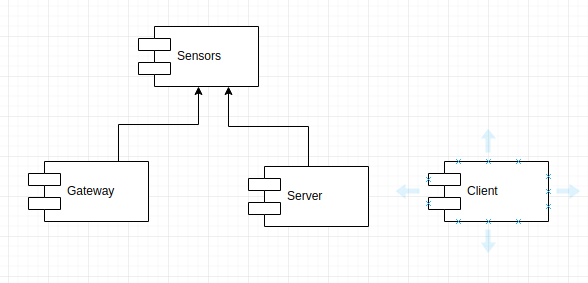
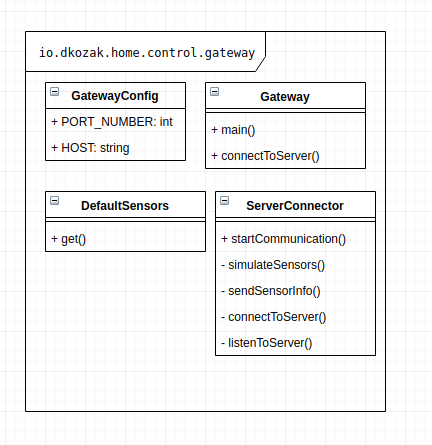
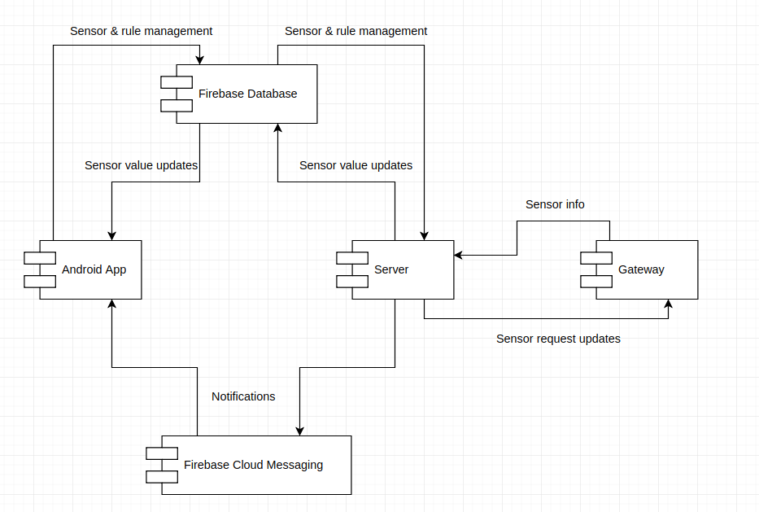
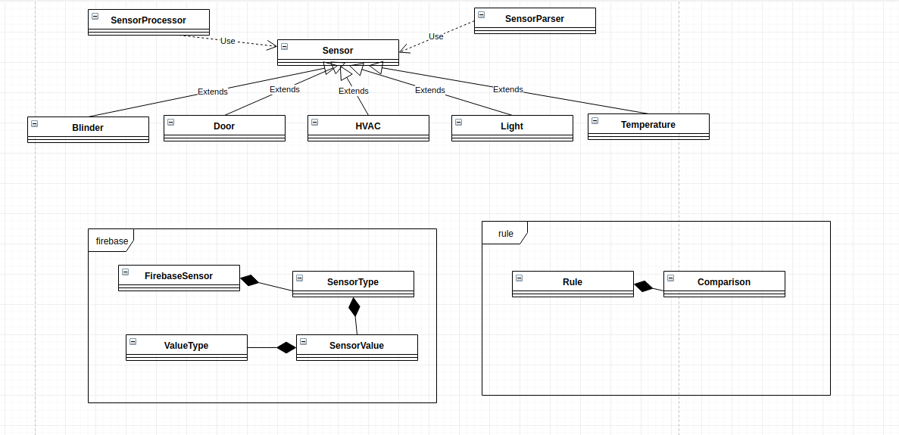
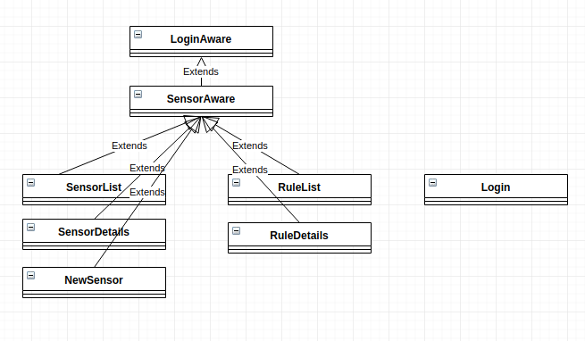
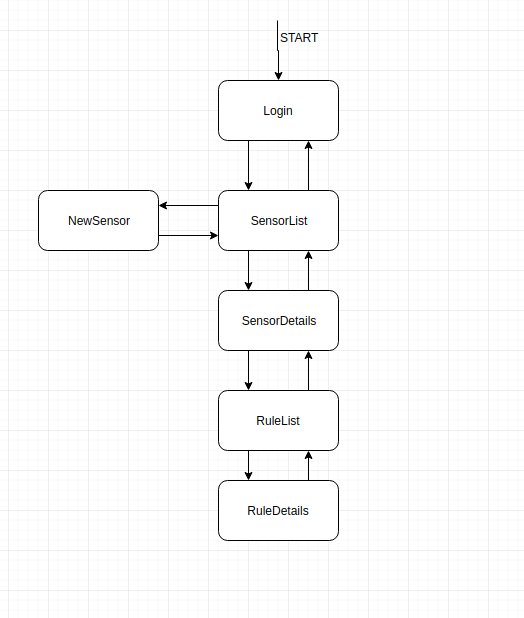

# Home control

* author: d-kozak
* mail: dkozak94@gmail.com

Home control is a IOT solution that allows users to monitor and change the values of sensors in their home. 
The whole system consists of four modules.

* Gateway
    * Simulates sensor data
* Server
    * Communicates with gateway and performs various data processing
* Client
    * Android app that can be used to visualize and change the values of the sensors
* Sensors
    * Contains common code shared between the server and the gateway. 

Dependencies between modules can be seen on the following diagram.


## Requirements
The client app requires Android version _7_ or higher.

The backend components require Java version _12_ with _preview features enabled_(switch expression). Gradle is used to build the backend components,
so running the following commands builds both server and gateway.
```
gradle jar
```
The command to start the server is
```
java  --enable-preview  -jar server/build/libs/server.jar
```
The command to start the gateway is
```
java  --enable-preview  -jar  gateway/build/libs/gateway.jar
```

For easier startup, [run.sh][./run.sh] shell script was written, which starts both the gateway and the server.

For editing the client, [Android Studio](https://developer.android.com/studio/?gclid=Cj0KCQjw9JzoBRDjARIsAGcdIDVKioluWo98udXZtLYEUFwdkUPb_eNCMVdCwZJFjLHwzXrjwyaDGioaAibbEALw_wcB)
is recommended and for editing the backend, you are encouraged to use [IntelliJ IDEA](https://www.jetbrains.com/idea/specials/idea/ultimate.html?gclid=Cj0KCQjwo7foBRD8ARIsAHTy2wnI0oTQIOPsaqz6WNrpCz_LZDErrCRMYsIeAC3FQF1t699ipOkOpcwaAui9EALw_wcB),
even though other IDEs should work as well as long as they support Gradle projects. 

## Structure
In this section, the design and implementation of the four components will be discussed.

### Gateway
This module simulates sensor data. It communicates with the server through a socket at localhost:3000.
In the beginning it sends information about available sensors to the server and then it regularly generates random new sensor data.
Also it keeps track of current sensor values and updates them when it receives notifications from the server.
It's class diagram is the following.


### Server
The main functions of this component are the following.
 
* handle data coming from the gateway and persist them in the firebase database
* trigger user rules if necessary
* propagate requests for sensor changes from the client to the gateway

When started, it waits for the Gateway to connect. Then it retrieves information about current sensors
and saves them in the firebase database. 

Then it listens for sensor updates from the gateway and propagates them to the database.
It also setups listeners for sensor change requests from the client 
and propagates them to the backend.

The complete flow of data can be seen on the following diagram


### Sensors
This module contains domain classes used in the backend and also shared processing logic such as parsing
and serializing sensor data.


### Client 
The client app consists of 6 main activities. There are also two helper abstract activities for easier code sharing, SensorAwareActivity and LoginAwareActivity,
from which most of the other activities inherit. LoginAwareActivity ensures that only logged in user can access the content. SensorAwareActivity provides hooks
for listening to sensor and rule data changes from Firebase.


When the app is opened, LoginActivity is loaded, which triggers authentication using Firebase. When it is done, the SensorListActivity is started.
In this one, the user can see a list of all his sensors. He can also add new sensors using the NewSensorActivity. After clicking on a specific sensor,
user is redirected to the SensorDetailsActivity. Here it is possible to visualize and change data for one particular sensor. Also, the RuleListActivity
showing all rules associated with this sensor is accessible from here. After clicking on an individual rule, the user is redirected to a RuleDetails activity,
where he can tweak the rule. The whole flow is visualized on the following diagram.

 

## Conclusion
The goal of this assignment was to create an IOT solution, both client and the server. Sensor data were simulated.
The main requirements were the following.

### Server
- [x] Access to a Firebase real-time database
- [x] Functional paradigm
- [ ] Logs using AOP
    * NOT implemented, because I could not find any working way how to integrate Java 12, Gradle 5, Lombok and AspectJ. Spring is doing it somehow, so it
    should be possible, but none of the ways I tried worked for me. Therefore the logs are handled using Lombok's @Log.  
- [x] Register users using Firebase Auth
- [x] Notifications using Firebase Cloud Messaging
- [x] Logs visualizing server state
- [x] Socket for connecting with the Gateway

### Client
- [x] Synchronize state with the server
    * done using Firebase Real-time database
- [x] Modify current state of sensors
- [x] Receive notifications
- [x] Show real-time data and history for sensor values
